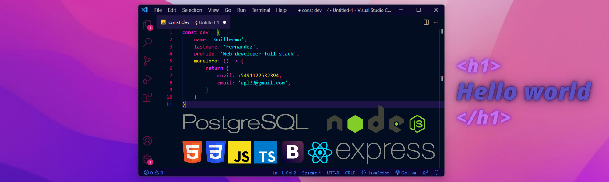

<code></code>
### Hola Soy Guillermo 👋

😁¿Quieres saber sobre mi?
Soy un Desarrollador web full stack, con orientación al front-end. Con la capacidad de realizar proyectos pensando siempre en la modularización y escalabilidad de los mismos. 

☺️¿Cuál es mi diferencial?
Tengo el gusto de hacer alarde de mi capacidad de resolución de problemas, dinamismo y proactividad. Pero sobre todo de una curiosidad insaciable, al igual que mis deseos de seguir aprendiendo y formándome en el hermoso mundo IT.

👨‍💻¿Mi Historia laboral?
Mi experiencia es mayoritariamente acádemica, tengo el agrado de pertenecer a Henry donde actualmente me encuentro cursando el bootcamp, donde he podido desarrollar habilidades técnicas pero también sociales como developer.

💁‍♂️¿Quieres saber más? 

🫰¡Contáctame!

 

## :star: Languages and Tools:

  
  
  
  
  
  
  
  
  
  

&nbsp;
