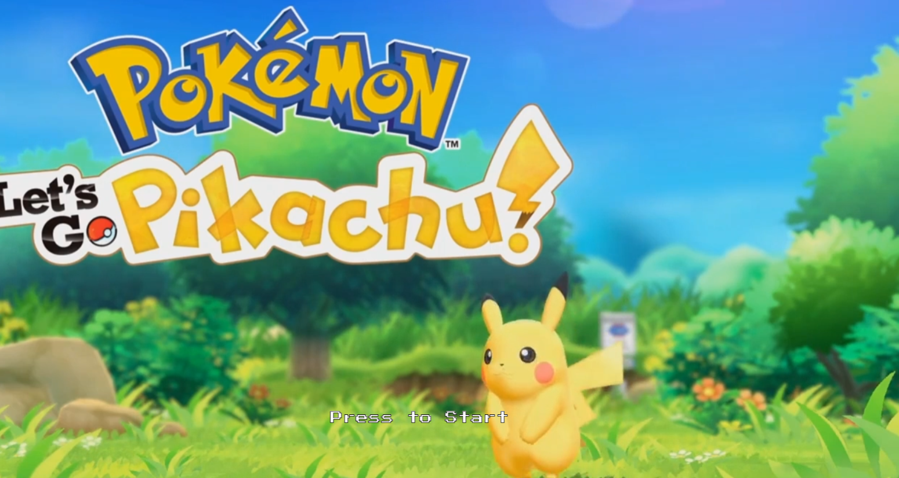
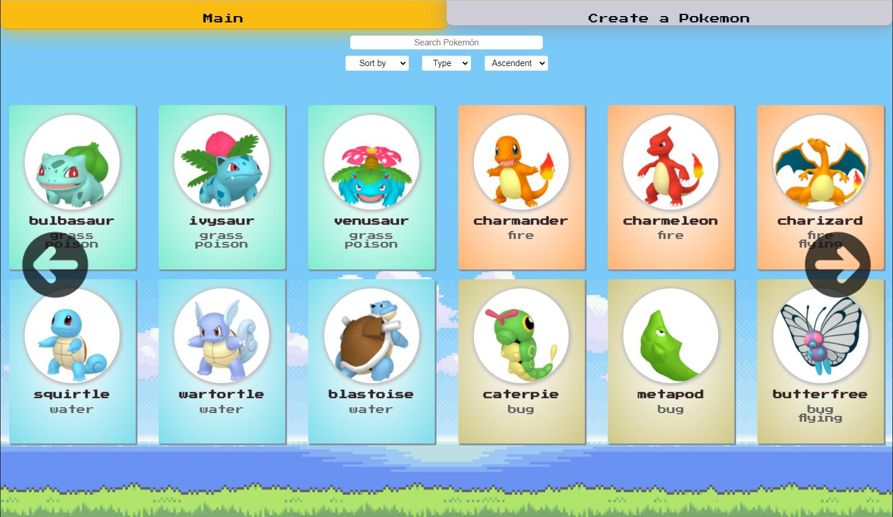
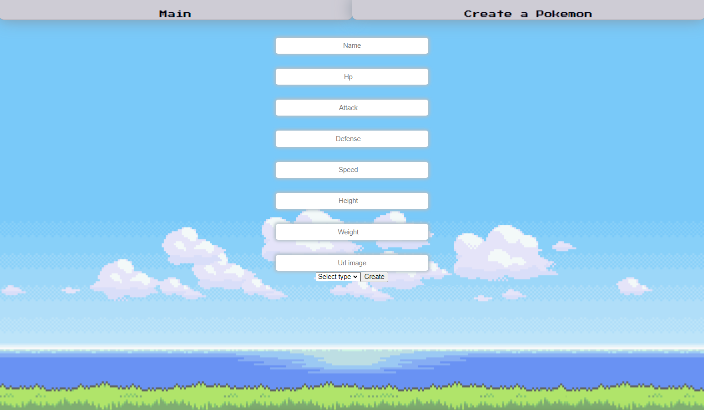
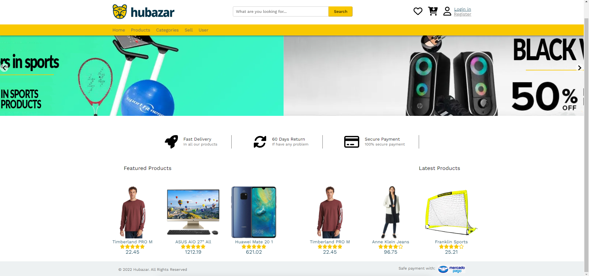
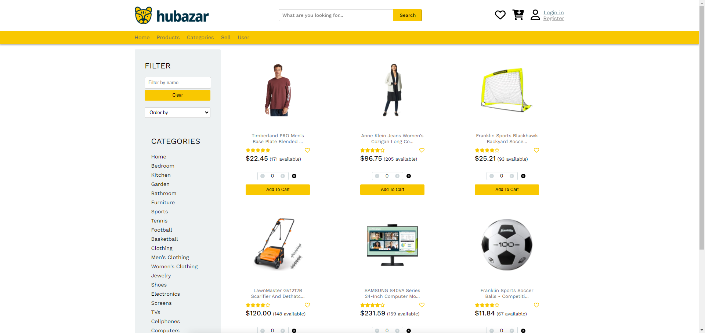
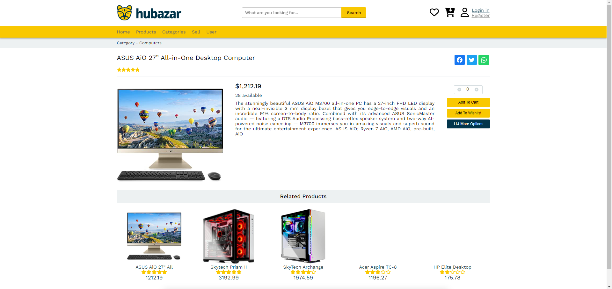
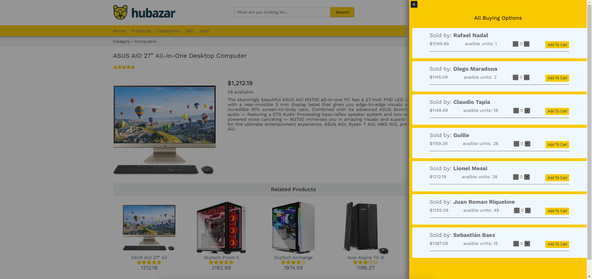
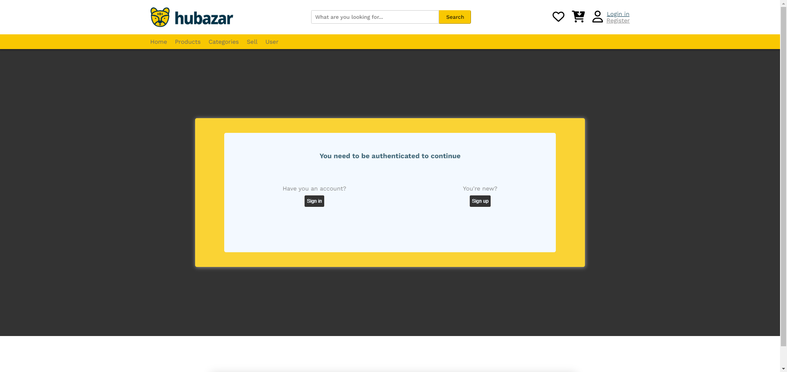
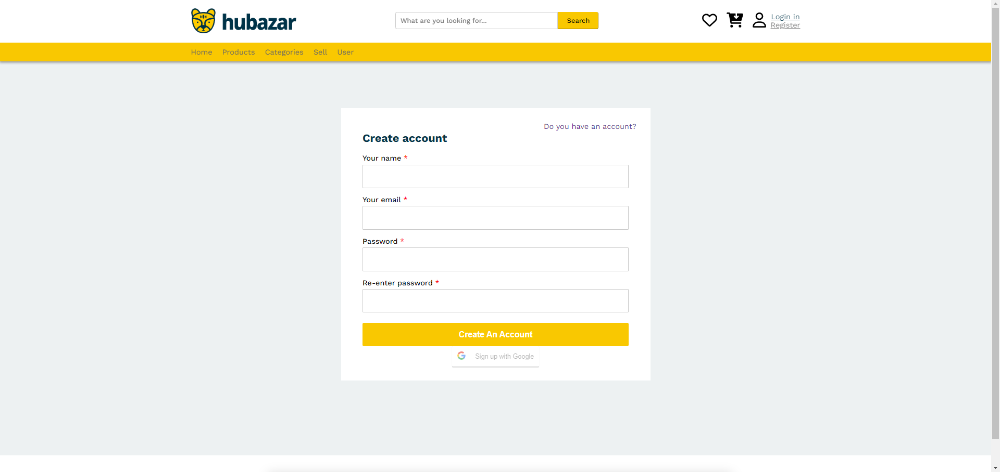

<code></code>
<h1 align='center'>Full Stack Web Developer 🦊 from Argentina to 🌎</h1>


😁¿Quieres saber sobre mi?
Soy un Desarrollador web full stack, con orientación al front-end. Con la capacidad de realizar proyectos pensando siempre en la modularización y escalabilidad de los mismos. 

☺️¿Cuál es mi diferencial?
Tengo el gusto de hacer alarde de mi capacidad de resolución de problemas, dinamismo y proactividad. Pero sobre todo de una curiosidad insaciable, al igual que mis deseos de seguir aprendiendo y formándome en el hermoso mundo IT.

👨‍💻¿Mi Historia laboral?
Mi experiencia es mayoritariamente acádemica, tengo el agrado de pertenecer a Henry donde actualmente me encuentro cursando el bootcamp, donde he podido desarrollar habilidades técnicas pero también sociales como developer.

💁‍♂️¿Quieres saber más? 

🫰¡Contáctame!
<p>
<a href='https://wa.me/5491122532394' target="_blank" >
    
</a>
<a href='mailto:uhgl33@gmail.com' target="_blank">
    
</a> 
<a href='https://www.linkedin.com/in/guillermo-fernandez-villarreal/' target="_blank">
    
</a>
</p>
&nbsp;

## :star: Languages and Tools:

<p align='center'>
  
  
  
  
  
</p>
<p align='center'>
  
  
  
  
  
</p>

&nbsp;

## :pushpin: My proyects

#### Pokeapi

<p align='center'>
  
  
  
</p>

```javascript
const implemented = {
   technologies: {
      frontEnd: {
         js: ["React", "Redux"],
         css
      },
      backEnd: {
         js: ["Node", "Express"]
      },
      databases: ["PostgreSQL"],
   },
};
```

### Hubazar eccomerce

<p align='center'>
  
  
  
</p>
<p align='center'>
  
  
  
</p>

### colaborators
#### front
<a href='https://github.com/tenhitokiri' target='_blank'><p>Christian Mejia</p></a>
<a href='https://github.com/juangoicochea' target='_blank'><p>Juan Carlos Goicochea</p></a>
#### back
<a href='https://github.com/jparaducha' target='_blank'><p>Juan Paraducha</p></a>
<a href='https://github.com/DeLaColinaSalvador' target='_blank'><p>Salvador Alejandro de la Colina</p></a>
<a href='https://github.com/davidbau22' target='_blank'><p>David Augusto Bautista</p></a>

```javascript
const implemented = {
   technologies: {
      frontEnd: {
         js: ["React", "Redux"],
         css
      },
      backEnd: {
         js: ["Node", "Express"]
      },
      databases: ["PostgreSQL"],
   },
};
```